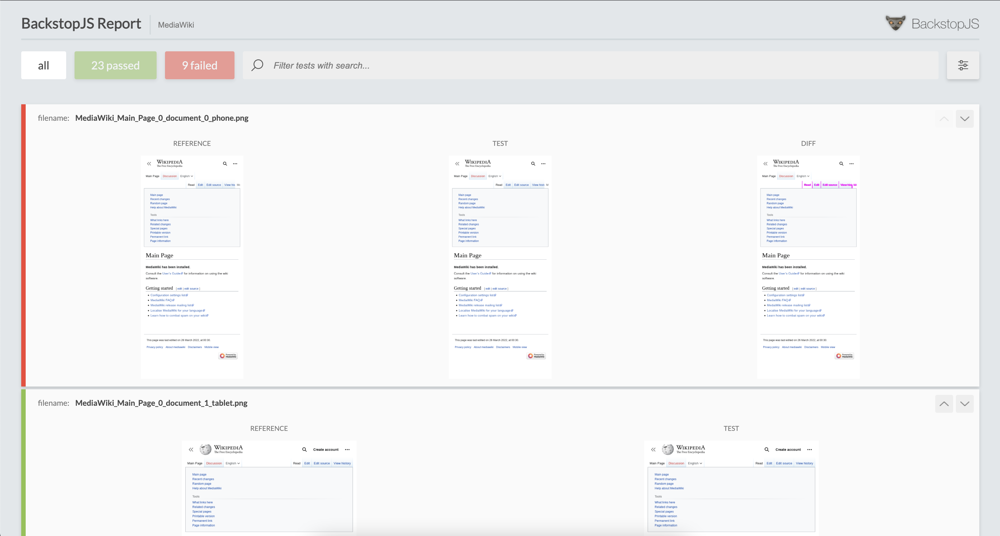

# Pixel



🚨 **Pixel is a work in progress and experimental. Only use it when you're feeling dangerous.** 🚨

Pixel is a visual regression tool for MediaWiki developers/QA engineers that
helps you replace manual testing with automated tests that catch web ui
regressions before users see them. It *currently* integrates
[BackstopJS](https://github.com/garris/BackstopJS),
[MediaWiki-Docker](https://www.mediawiki.org/wiki/MediaWiki-Docker), and Docker
under the hood.

Please read [T302246](https://phabricator.wikimedia.org/T302246) for the
motivation behind Pixel.

## Quick Start

First, clone the repo wherever you wish and `cd` into it:

```sh
git clone https://github.com/nicholasray/pixel.git && cd pixel
```

Pixel runs in multiple Docker containers to eliminate inconsistent rendering
issues across environments and also to make local installation a breeze. Please
install [Docker](https://docs.docker.com/get-docker/) and **make sure it is
running** prior to using Pixel.

Finally, install the CLI dependency:

```sh
npm install
```

## Usage

Your workflow will usually involve the following ordered steps:

### 1) Take reference (baseline) screenshots with `master` or release branch code

If you want to checkout the latest code in `master` or `main` from MediaWiki
core and all of its installed extensions and skins and then take reference
screenshots that your test snapshots (step 2) will be compared against, then:

```sh
./pixel.js reference
```

Or if you want the reference to be a certain release branch:

```sh
./pixel.js reference -b origin/wmf/1.37.0-wmf.19
```

### 2) Take test screenshots with changed code

If you want to pull a change or multiple changes down from gerrit, take screenshots with these changes on top of master and then compare these screenshots against the reference screenshots, then

```sh
./pixel.js test -c Iff231a976c473217b0fa4da1aa9a8d1c2a1a19f2
```

Note that although change id `Iff231a976c473217b0fa4da1aa9a8d1c2a1a19f2` has a
`Depends-On` dependency, it is the only change that needs to be passed. Pixel
will figure out and pull down the rest of the dependencies provided that it has
the relevant repositories (set in repositories.json).

An HTML report of your test resuls with screenshots will be opened automatically
on a Mac after the test completes. If you're not on a Mac, you can manually open
the file at `app/backstop_data/html_report/index.html`.

Additionally, Pixel runs a server at `http://localhost:3000` (default) which can
be used to interact with/debug the same server that the tests use.

### Stopping the services

If you want to stop all of Pixel's services, run:

```
npm stop
```

### Cleanup

Sometimes after making MediaWiki code changes, database changes, or having
issuees with the containers you just want to throw away everything and start
Pixel with a clean slate. To do that, simply run:

```
npm run clean
```

Note that if you've made changes to LocalSettings.php and want to reset that,
you'll also need to run:

```
git checkout -- LocalSettings.php
```

## Development

### Changing or adding tests

All tests are located in [backstop.config.js](app/backstop.config.js) and follow
BackstopJS conventions. For more info on how to change or add tests, please
refer to the [BackstopJS](https://github.com/garris/BackstopJS) README.

### Configuring MediaWiki

All mediawiki config is in [LocalSettings.php](LocalSettings.php) and can be
changed. For example, maybe you are working on a new feature in the `Vector`
skin that is feature flagged and want to enable it. All changes made in this
file will be automatically reflected in the Docker services without having to
restart them.

### Installed extensions and skins

Pixel ships with a number of MediaWiki extensions and skins already installed.
Please reference the [repositories.json](repositories.json) file to see a
list of these.
